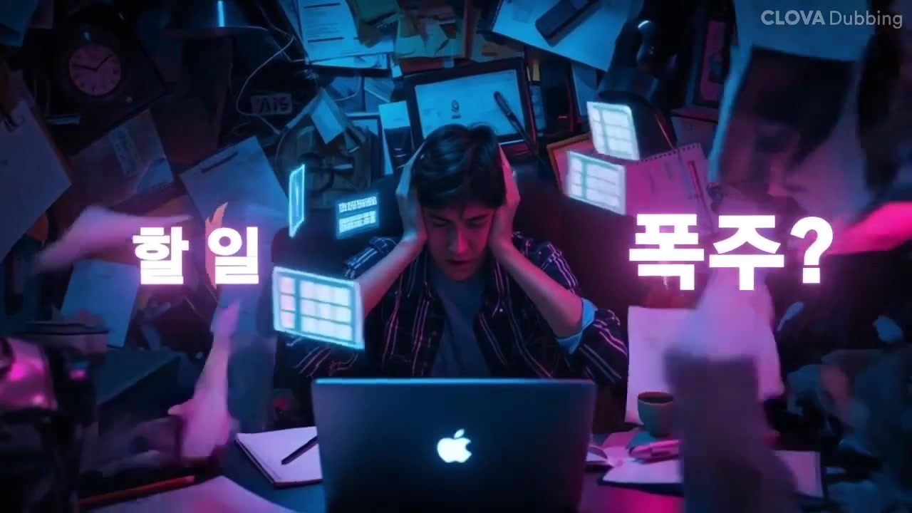
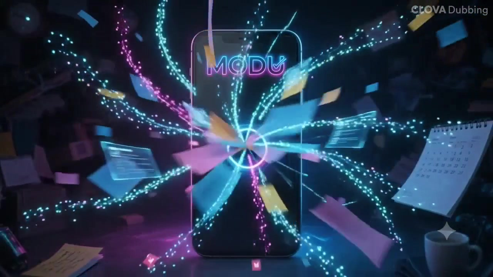
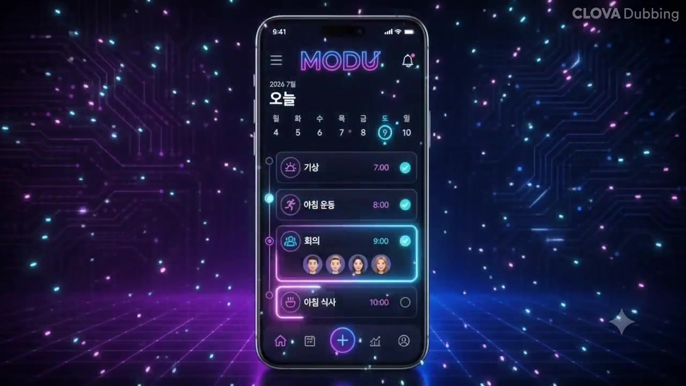
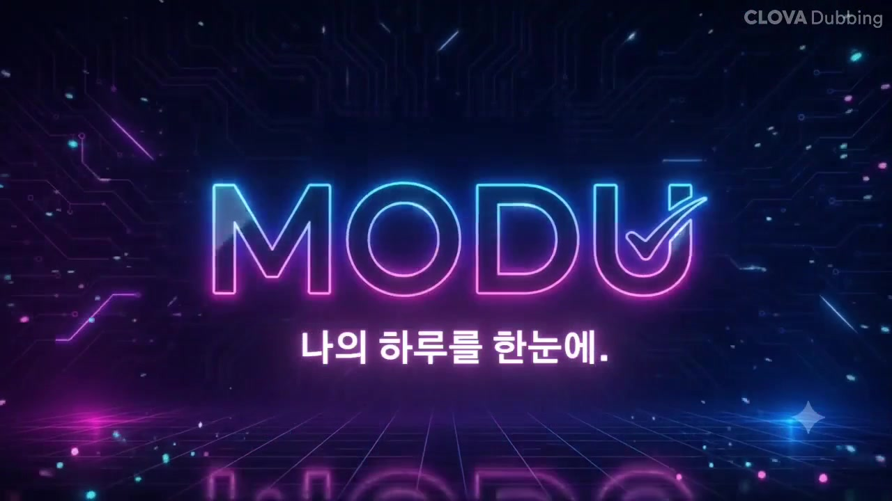
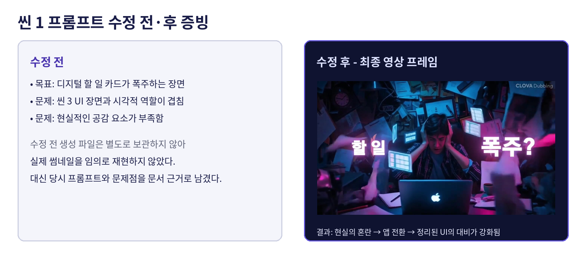
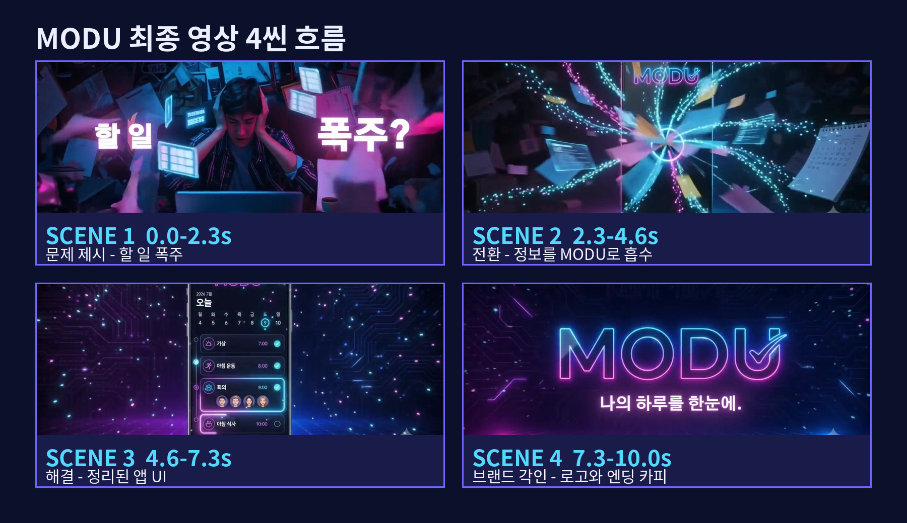

<div id="modu-ai-브랜드-광고-스토리보드" class="section cover">

# MODU AI 브랜드 광고 스토리보드

## 멀티모달 콘텐츠 제작 최종본

**제출자:** 신의령  
**브랜드:** MODU - 가상의 AI 일정·할 일 정리 플래너 앱  
**최종 영상:** 10.000초 / 16:9 / 1280x720 / 30fps

</div>

------------------------------------------------------------------------

## 1. 최종 제출물과 GitHub 문서 구분

과제 안내에서 요구하는 **최종 제출물은 아래 PDF 1개와 MP4 1개, 총 2개**이다.

| 구분 | 최종 제출 파일명 | 설명 |
|---|---|---|
| 스토리보드 PDF | `MODU_storyboard_shinuiryeong.pdf` | 브랜드 기획, 씬 구성, 프롬프트, 생성·편집·검수 의사결정 기록 |
| 최종 광고 영상 | `MODU_brand_ad_shinuiryeong_final_10s.mp4` | 생성형 AI 시각·청각 소스를 통합한 10.000초 광고 |

`README.md`는 기존 스토리보드 Markdown 원본의 내용을 옮긴 **GitHub 저장소 설명 문서**이다. 제작 과정과 프롬프트를 온라인에서 확인하기 위한 보조 문서이며, 위의 과제 최종 제출물 2개에는 포함되지 않는다. README 안의 씬별 이미지를 표시하려면 `MODU_storyboard_assets/` 폴더를 함께 GitHub에 업로드한다.

MODU는 과제 수행을 위해 기획한 **가상 브랜드**이며 실제 출시 서비스가 아니다. 최종 광고는 **문제 제시 - MODU 실행 - 일정 정리 - 브랜드 각인**의 흐름으로 구성하였다.

------------------------------------------------------------------------

## 2. 브랜드 아이덴티티와 캠페인 정의

### 브랜드 아이덴티티 요약

MODU는 지원서, 과제, 회의, 약속처럼 여러 일정이 동시에 쌓이는 **20~30대 취업준비생·프리랜서·직장인**을 위한 가상의 AI 생산성 앱이다. 복잡한 정보를 자동으로 분류해 한 화면에 정리한다는 **USP**를 중심으로, 다크 네이비와 딥 퍼플 위에 네온 블루·핑크를 반복하는 경쾌한 사이버펑크 톤을 사용했다. 브랜드는 전문적인 관리 도구라기보다, 사용자의 복잡한 하루를 빠르고 부담 없이 정리해주는 친근한 AI 비서로 표현했다.

| 항목        | 내용                                                                           |
|-------------|--------------------------------------------------------------------------------|
| 브랜드명    | MODU                                                                           |
| 발음        | 모두                                                                           |
| 브랜드 유형 | AI 일정·할 일 정리 플래너 앱                                                   |
| 주요 타깃   | 할 일과 일정이 많은 20~30대 취업준비생, 프리랜서, 직장인                       |
| 타깃의 문제 | 지원서, 과제, 회의, 약속, 개인 일정이 한꺼번에 쌓여 우선순위를 정하기 어렵다.  |
| 톤앤매너    | 네온, 사이버펑크, 경쾌한 디지털 생산성 광고                                    |
| 시각 키워드 | 다크 네이비, 딥 퍼플, 네온 블루·핑크, 글로우, 카드형 UI                        |
| 브랜드 성격 | 빠르고 똑똑하지만 부담스럽지 않은 AI 비서                                      |
| USP         | 흩어진 일정과 할 일을 AI가 자동으로 분류해 한 화면에 정리한다.                 |
| 캠페인 목적 | 브랜드 인지: 첫 노출에서 MODU를 ’복잡한 하루를 정리하는 앱’으로 기억하게 한다. |
| 핵심 메시지 | **흩어진 일정, 과제, 약속을 MODU가 한눈에 정리해준다.**                        |
| 광고 구조   | 할 일 폭주 - 정보 흡수 - 정리된 대시보드 - 로고와 엔딩 카피                    |

### 최종 화면 카피와 내레이션

| 구간      | 화면 카피             | 내레이션                       |
|-----------|-----------------------|--------------------------------|
| 문제 제시 | `할 일 폭주?`         | `할 일이 너무 많아?`           |
| 전환      | 없음                  | `모두가 모~두 정리해줄게!`     |
| 해결      | 없음                  | `일정, 과제, 약속까지 한눈에.` |
| 엔딩      | `나의 하루를 한눈에.` | `모두.`                        |

TTS 입력에서는 브랜드 발음을 자연스럽게 강조하기 위해 `모오오두`처럼 길게 표기했으며, 문서에는 실제 청취 의미에 맞춰 `모~두`로 정리하였다. 화면에서는 영문 로고 `MODU`를 유지해 브랜드 표기를 통일하였다.

------------------------------------------------------------------------

## 3. 제작 파이프라인과 도구 역할

> 기획 정의 - 로고·UI 기준 이미지 제작 - 씬별 키비주얼 생성 - 이미지 기반 영상 변환 - BGM·내레이션 생성 - CapCut 통합 편집 - 색감·오디오·출력 검수 - 최종 MP4

| 구분             | 실제 사용 도구                | 사용 목적과 강점                                                                                              | 주의점                                                                         | 대체 도구                          |
|------------------|-------------------------------|---------------------------------------------------------------------------------------------------------------|--------------------------------------------------------------------------------|------------------------------------|
| 이미지 생성      | Ideogram, ChatGPT 이미지 생성 | 로고, 앱 UI 기준 이미지, 씬별 키비주얼 제작. 정지 화면에서 구도와 색을 먼저 확정해 영상 재생성 횟수를 줄였다. | 긴 한글 문구와 세부 UI는 변형될 수 있어 최종 자막은 편집 단계에서 추가했다.    | Google Whisk, Canva AI 이미지 생성 |
| 비디오 생성·변환 | Google Flow                   | 종이·카드 흡수, 네온 입자, UI 활성화처럼 정지 이미지에 짧은 모션을 부여했다.                                  | 로고와 UI가 변형되지 않도록 reference 고정과 금지 지시를 반복했다.             | Kling, Pika                        |
| BGM 생성         | Suno                          | 10초 광고용 가사 없는 경쾌한 전자음악을 제작했다.                                                             | 내레이션과 충돌하지 않도록 보컬 없는 곡으로 제한했다.                          | Stable Audio, Beatoven             |
| 음성 합성        | 클로바더빙                    | 발랄한 여성 톤의 한국어 내레이션을 생성했다.                                                                  | 영문 `MODU`를 글자 단위로 읽는 문제가 있어 음성 입력은 한글 `모두`로 변경했다. | 타입캐스트, TTSMaker, CapCut TTS   |
| 통합 편집        | CapCut                        | 컷 편집, 화면 카피, 오디오 레벨, 색감 일치, 최종 인코딩에 사용했다.                                           | 핵심 비주얼과 오디오는 생성형 AI 결과물을 유지했다.                            | Canva Video, Premiere Pro          |

### 도구 선택 변경 기록

초기에는 CapCut TTS를 사용하려 했으나 음성 생성 오류와 `MODU` 발음 문제가 발생했다. 클로바더빙으로 변경한 뒤 한국어 억양이 안정되고, 음성에서는 `모두`, 화면에서는 `MODU`를 사용하는 브랜드 언어 전략을 적용할 수 있었다. 영상 생성은 크레딧 소모를 줄이기 위해 로고·UI·씬별 구도를 이미지 단계에서 먼저 확정한 후 Google Flow로 짧게 변환하였다.

------------------------------------------------------------------------

## 4. 도구별 산출물·포맷 및 에셋 출처 확인

### 도구별 최종 파일 예시

| 도구                         | 산출물 예시                                                                     | 포맷           | 최종 영상에서의 역할     | 증빙 상태                                                        |
|------------------------------|---------------------------------------------------------------------------------|----------------|--------------------------|------------------------------------------------------------------|
| Ideogram·ChatGPT 이미지 생성 | `01_reference/modu_logo_wordmark.png`, `01_reference/modu_app_ui_reference.png` | PNG            | 로고와 UI 기준 고정      | 원본 파일명 기록, 현재 제출 패키지에는 최종 프레임으로 결과 확인 |
| 이미지 생성                  | `02_image/scene01_overload_keyvisual.png` 등                                    | PNG            | 씬별 구도·색·피사체 확정 | 최종 MP4에서 확인 가능                                           |
| Google Flow                  | `03_video/scene01_overload_motion.mp4` 등 4개                                   | MP4            | 씬별 2.3~2.7초 모션      | 최종 MP4와 프레임 이미지로 확인 가능                             |
| Suno                         | `04_audio/modu_bgm_suno_electronic_pop.wav`                                     | WAV 또는 MP3   | 가사 없는 전자음악 BGM   | 최종 MP4 오디오 트랙에서 확인                                    |
| 클로바더빙                   | `04_audio/modu_voiceover_clovadubbing.wav`                                      | WAV 또는 MP3   | 한국어 여성 내레이션     | 최종 MP4 오디오 및 워터마크로 확인                               |
| CapCut                       | `05_edit/MODU_capcut_project_v03.mp4`                                           | MP4            | 컷·자막·색감·오디오 통합 | 최종본으로 확인                                                  |
| 최종 출력                    | `06_export/MODU_brand_ad_shinuiryeong_final_10s.mp4`                            | MP4, H.264/AAC | 제출용 광고 영상         | 최종 제출본은 괄호나 복사본 번호가 없는 파일명으로 통일          |

### 에셋 출처 체크리스트

| 에셋             |             생성형 AI 제작 | 직접 촬영 |   유료 스톡·유료 음원 |      외부 로고·상표 사용 | 확인 |
|------------------|---------------------------:|----------:|----------------------:|-------------------------:|------|
| 씬 1~4 시각 요소 |                         예 |    아니오 |                아니오 | 의도적으로 사용하지 않음 | 완료 |
| MODU 로고·앱 UI  |            예, 가상 브랜드 |    아니오 |                아니오 |                해당 없음 | 완료 |
| BGM              |                  Suno 생성 |    아니오 |                아니오 |                해당 없음 | 완료 |
| 내레이션         |            클로바더빙 생성 |    아니오 |                아니오 |                해당 없음 | 완료 |
| 최종 편집 요소   | CapCut 자막·전환·레벨 조정 | 해당 없음 | 별도 유료 리소스 없음 |                해당 없음 | 완료 |

> **검수 주의:** 씬 1의 AI 생성 노트북 표면에 특정 기업 로고를 연상시키는 표식이 보인다. 의도적으로 삽입한 외부 에셋은 아니지만, 브랜드 중립성을 더 높이려면 재생성 또는 블러·마스킹 후 제출하는 것이 안전하다.

### 이식 가능한 원본 경로 규칙

문서에는 개인 PC의 절대 경로 대신 아래 상대 경로를 사용한다. 따라서 프로젝트 폴더를 다른 PC로 이동해도 파일 연결 구조가 유지된다.

``` text
MODU_project/
├─ 00_docs/
├─ 01_reference/
├─ 02_image/
├─ 03_video/
├─ 04_audio/
├─ 05_edit/
├─ 06_export/
└─ 07_evidence/
```

------------------------------------------------------------------------

## 5. 스타일 일관성 제어 기준

| 제어 항목 | 고정 기준                                                                                           |
|-----------|-----------------------------------------------------------------------------------------------------|
| 기본 색상 | 다크 네이비 `#0B102B`, 딥 퍼플 `#25104A`, 네온 시안 `#39D6FF`, 네온 핑크 `#FF4FD8`                  |
| 인물 포즈 | 씬 1에서 책상 앞에 앉아 양손이 머리 가까이에 있는 압박 포즈. 과장된 동작보다 일상적인 스트레스 표현 |
| 인물 표정 | 긴장·피로가 느껴지되 공포·울음·극단적 표정은 제외. 얼굴은 광고의 주인공보다 상황 전달 요소로 사용   |
| 카메라    | 씬 1은 탑뷰 또는 30~45도 상단 시점, 씬 2~3 스마트폰은 정면 기준 기울기 0~5도 이내                   |
| 스마트폰  | 프레임 중앙, 전체 기기 노출, 상·하단 잘림 금지, 씬 간 크기 변화 최소화                              |
| 로고      | 공식 MODU 워드마크 구조 유지, 글자 재설계 금지, 화면 중앙 또는 상단 고정                            |
| 앱 UI     | `오늘`, 주간 캘린더, 일정 카드, 하단 플러스 버튼의 위치를 reference와 동일하게 유지                 |
| 글자      | 생성 이미지 안에는 긴 한국어를 넣지 않고, 핵심 카피는 CapCut에서 직접 입력                          |
| 모션      | 시안·핑크 입자는 정보 이동과 UI 활성화에만 사용. 화면 전체를 가리는 과도한 파티클 금지              |
| 금지 요소 | 로고 왜곡, 추가 브랜드, 손가락·얼굴 왜곡, 카메라 급회전, 최종 UI의 임의 재설계                      |

Google Flow 작업에서는 별도의 숫자형 `cref/sref` 파라미터를 기록하지 못했기 때문에, **공식 로고·UI reference 이미지 업로드 + “preserve”, “do not redesign”, “structurally unchanged” 같은 잠금 문장 반복**으로 일관성을 제어했다. 향후 숫자형 reference strength가 제공되는 도구를 사용할 경우 70~90% 범위에서 시작하고, 로고·UI 변형 여부를 확인하며 조정한다.

------------------------------------------------------------------------

## 6. 제작 방식·도구 선택의 시간·비용 비교

### T2I 우선 제작과 직접 I2V 제작 비교

아래 수치는 플랫폼의 실제 과금표가 아니라, 본 과제를 다시 제작할 때 사용할 **상대적인 작업 계획 추정치**다.

| 방식                        | 1개 결과 예상 시간 | 상대 비용 | 구도·텍스트 제어 |   모션 품질 | 주요 한계                                 | 본 과제 선택        |
|-----------------------------|-------------------:|----------:|-----------------:|------------:|-------------------------------------------|---------------------|
| T2I로 키비주얼 확정         |              1~3분 |       1배 |            4.5/5 | 정지 이미지 | 움직임 없음, 한글·세부 UI 왜곡 가능       | 먼저 수행           |
| 텍스트만으로 직접 영상 생성 |             5~15분 |    6~12배 |            2.5/5 |         4/5 | 구도·로고·UI가 흔들리고 재시도 비용 큼    | 사용하지 않음       |
| 확정 이미지 기반 I2V        |             3~10분 |     4~8배 |            3.5/5 |         4/5 | 모션 중 세부 구조가 변형될 수 있음        | 최종 선택           |
| 정지 이미지 + 편집 모션     |              1~5분 |   0.5~1배 |              5/5 |       2.5/5 | 생성 영상보다 깊이감과 물리 모션이 단순함 | 크레딧 부족 시 대안 |

### 도구 후보 내부 평가

점수는 본 프로젝트 기획 단계에서의 **주관적 5점 평가**이며, 공식 벤치마크나 과금 수치가 아니다.

| 도구                         | 예상 품질 | 속도 | 비용 효율 | 선택 판단                                 |
|------------------------------|----------:|-----:|----------:|-------------------------------------------|
| Ideogram·ChatGPT 이미지 생성 |       4.2 |  4.0 |       4.0 | 구도와 브랜드 기준 이미지 제작에 적합     |
| Google Flow                  |       4.3 |  2.8 |       2.7 | 흡수·입자·UI 활성화 모션 품질 때문에 선택 |
| Kling                        |       4.1 |  2.6 |       2.8 | Flow 제한 시 대체 가능한 I2V 후보         |
| Pika                         |       3.8 |  3.8 |       3.5 | 빠른 테스트·간단한 모션 대안              |
| Suno                         |       4.2 |  4.0 |       4.0 | 짧은 광고용 전자음악 생성에 적합          |
| 클로바더빙                   |       4.0 |  4.5 |       4.5 | 한국어 발음 안정성과 접근성 때문에 선택   |

### 예상 생성 횟수·상대 크레딧 계획

정확한 과거 API 호출 수와 플랫폼 크레딧 로그는 별도로 저장하지 않아 임의의 실제값을 만들지 않았다. 아래는 **재제작 시 사용할 계획치**이며, 상대 크레딧 단위는 `T2I 1회=1`, `I2V 1회=6`, `BGM 1회=2`, `TTS 1회=1`로 정의한다.

| 작업              | 권장 시도 횟수 |    상대 크레딧 예상 | 기록된 최종 채택본 |
|-------------------|---------------:|--------------------:|--------------------|
| 로고·UI reference |       각 2~4회 |                 4~8 | 로고 1, UI 1       |
| 씬 1~4 키비주얼   |     씬별 1~3회 |                4~12 | 씬별 1개           |
| 씬 1~4 I2V        |     씬별 1~2회 |               24~48 | 씬별 1개           |
| Suno BGM          |          1~2회 |                 2~4 | 1개                |
| 클로바더빙        |          2~3회 |                 2~3 | 1개                |
| 합계 계획 범위    |        13~25회 | **36~75 상대 단위** | 최종 영상 1개      |

생성할 때는 `도구 / 날짜 / 프롬프트 버전 / 생성 번호 / 채택 여부 / 문제점 / 크레딧`을 로그로 기록한다. 이 표는 서비스별 실제 요금이 아니라 작업량 비교용이다.

------------------------------------------------------------------------

## 7. 최종 영상 검수 결과와 정확한 프레임 구성

첨부된 최종 MP4를 기준으로 확인한 실제 스펙은 다음과 같다.

| 항목               |                       실제 결과 |       과제 기준 | 판정 |
|--------------------|--------------------------------:|----------------:|------|
| 길이               |                    **10.000초** |       10초 이내 | 충족 |
| 총 프레임          |                   **300프레임** | 30fps 기준 10초 | 충족 |
| 해상도             |                    **1280x720** |  720p 이상 허용 | 충족 |
| 화면 비율          |                        **16:9** |     계획과 통일 | 충족 |
| 프레임레이트       |                       **30fps** |   권장 24~30fps | 충족 |
| 비디오 코덱        |                       **H.264** |      권장 H.264 | 충족 |
| 오디오 코덱        |        **AAC / 48kHz / Stereo** |        권장 AAC | 충족 |
| AI 시각 요소       |  생성 이미지와 Google Flow 모션 |            필수 | 충족 |
| AI 청각 요소       |  Suno BGM과 클로바더빙 내레이션 |   1개 이상 필수 | 충족 |
| 마지막 브랜드 장치 | 7.3초부터 MODU 로고와 엔딩 카피 |    마지막 3~5초 | 충족 |

현재 최종본은 **정확히 10.000초**이므로 추가 절단이 필요하지 않다. 30fps 타임라인의 유효 프레임은 0~299번이며, 프레임 300을 포함해 출력하면 10초를 초과할 수 있으므로 내보내기 범위는 `00:00:00:00~00:00:09:29`로 설정한다.

### 씬별 목표·최소 프레임

| 씬             | 목표 구간 |      목표 프레임 | 최소 지속시간 | 최소 프레임 | 단축 시 판단                                    |
|----------------|-----------|-----------------:|--------------:|------------:|-------------------------------------------------|
| 씬 1 문제 제시 | 0~68      | 69프레임, 2.30초 |        1.80초 |          54 | 카피를 읽을 수 있고 혼란 상황이 인지돼야 함     |
| 씬 2 전환      | 69~137    | 69프레임, 2.30초 |        2.00초 |          60 | 정보가 스마트폰으로 흡수되는 방향성이 보여야 함 |
| 씬 3 해결      | 138~218   | 81프레임, 2.70초 |        2.40초 |          72 | 일정 카드와 정리된 UI를 확인할 시간이 필요      |
| 씬 4 엔딩      | 219~299   | 81프레임, 2.70초 |        2.50초 |          75 | 로고와 엔딩 카피의 읽기 시간을 보장             |

------------------------------------------------------------------------

## 8. 전체 타임라인

| 시간          | 씬 역할     | 화면 구성                                              | 화면 카피             | 내레이션                       |
|---------------|-------------|--------------------------------------------------------|-----------------------|--------------------------------|
| 0:00~0:02.3   | 문제 제시   | 네온 조명의 복잡한 책상, 인물, 종이와 알림 카드가 폭주 | `할 일 폭주?`         | `할 일이 너무 많아?`           |
| 0:02.3~0:04.6 | 전환        | 종이·메모·디지털 카드가 MODU 스마트폰으로 흡수         | 없음                  | `모두가 모~두 정리해줄게!`     |
| 0:04.6~0:07.3 | 해결        | 정리된 MODU 앱 UI와 일정 카드가 활성화                 | 없음                  | `일정, 과제, 약속까지 한눈에.` |
| 0:07.3~0:10.0 | 브랜드 각인 | 스마트폰 실루엣에서 MODU 로고 엔딩 카드로 전환         | `나의 하루를 한눈에.` | `모두.`                        |

------------------------------------------------------------------------

## 9. 씬별 스토리보드와 출력 증빙

## 씬 1. 할 일 폭주 - 현실의 혼란

<figure class="scene-figure">

<figcaption>실제 최종 영상 대표 프레임: 네온 작업 공간과 화면 카피 ‘할 일 폭주?’</figcaption>
</figure>

| 필수 항목          | 내용                                                                                                                         |
|--------------------|------------------------------------------------------------------------------------------------------------------------------|
| 씬 번호 / 길이     | 씬 1 / 69프레임 / 약 2.3초                                                                                                   |
| 목표 메시지        | 사용자가 과도한 할 일과 일정에 압도되는 문제를 즉시 보여준다.                                                                |
| 화면 구성          | 탑뷰에 가까운 네온 조명의 작업 공간. 인물이 머리를 감싸고 있고 노트북, 종이, 포스트잇, 디지털 카드가 주변을 빠르게 움직인다. |
| 내레이션 또는 카피 | 화면 `할 일 폭주?` / 내레이션 `할 일이 너무 많아?`                                                                           |
| 사용 도구와 목적   | Ideogram·ChatGPT 이미지 생성: 키비주얼 / Google Flow: 종이와 카드의 폭주 모션 / CapCut: 카피 배치                            |
| 프롬프트 기대 출력 | 현실적인 책상과 인물의 압박감, 브랜드 네온 색, UI가 아직 등장하지 않는 문제 장면                                             |
| 실제 출력 결과     | 일상적 혼란과 네온 분위기가 결합되어 광고의 문제 제시가 즉시 이해됨                                                          |
| 결과 파일명        | `02_image/scene01_overload_keyvisual.png` / `03_video/scene01_overload_motion.mp4` / `07_evidence/scene01_final_frame.jpg`   |

### 입력 프롬프트 - 이미지 생성

``` text
chaotic everyday life scene for a 10-second commercial opening, showing a young adult overwhelmed by too many things to do, messy but visually appealing desk or compact room, laptop, planner, sticky notes, calendar page, coffee cup, study materials, resume papers, notebook, ringing smartphone, bag, clock, delivery box, to-do memo, multiple daily responsibilities all appearing at once, busy morning atmosphere, stressful and overwhelming mood, realistic daily life chaos, cinematic advertising composition, futuristic city-inspired mood, dark navy and deep purple environment, neon blue and neon pink lighting accents, subtle cyberpunk atmosphere, soft neon reflections, digital glow, premium tech brand aesthetic, high contrast, stylish and emotional commercial look, 16:9 composition, no app UI, no smartphone dashboard, no central interface, no clear human face, no brand logos, no readable long text.
```

### 입력 프롬프트 - 영상 변환

``` text
2-second commercial opening shot using the original image composition. Preserve the overwhelmed person, laptop, desk, room layout, lighting, and existing objects. Papers, sticky notes, calendar pages, checklist icons, and translucent holographic task cards lift from the cluttered room and swirl chaotically around the person. Use subtle cinematic push-in, slight handheld shake, neon blue and neon pink reflections, realistic paper flutter, and motion blur. Do not reveal an app UI or smartphone dashboard.
```

------------------------------------------------------------------------

## 씬 2. MODU 실행 - 정보를 한곳으로 흡수

<figure class="scene-figure">

<figcaption>실제 최종 영상 대표 프레임: 종이와 일정 카드가 MODU 스마트폰으로 이동</figcaption>
</figure>

| 필수 항목          | 내용                                                                                                                             |
|--------------------|----------------------------------------------------------------------------------------------------------------------------------|
| 씬 번호 / 길이     | 씬 2 / 69프레임 / 약 2.3초                                                                                                       |
| 목표 메시지        | MODU가 흩어진 할 일과 일정 조각을 한곳으로 모으는 해결 도구임을 보여준다.                                                        |
| 화면 구성          | 스마트폰이 중앙 정면에 나타나고 종이, 포스트잇, 체크리스트, 홀로그램 카드가 곡선을 그리며 화면 중심으로 빨려 들어간다.           |
| 내레이션 또는 카피 | 화면 카피 없음 / 내레이션 `모두가 모~두 정리해줄게!`                                                                             |
| 사용 도구와 목적   | ChatGPT 이미지 생성·Ideogram: 스마트폰과 로고 기준 이미지 / Google Flow: 흡수·입자 변환 모션                                     |
| 프롬프트 기대 출력 | 씬 1의 사물이 스마트폰으로 모이며, 최종 UI는 아직 공개되지 않는 전환 화면                                                        |
| 실제 출력 결과     | 현실의 혼란이 디지털 입자로 전환돼 앱으로 들어가며 문제와 해결을 자연스럽게 연결                                                 |
| 결과 파일명        | `02_image/scene02_modu_intake_keyvisual.png` / `03_video/scene02_modu_intake_motion.mp4` / `07_evidence/scene02_final_frame.jpg` |

### 입력 프롬프트 - 이미지 생성

``` text
Use the official MODU logo image as the fixed brand identity reference. Create a complete smartphone upright in the center of the frame, full front view, entire phone visible, straight-on angle. Surround the phone with floating elements from Scene 1: large blue and pink paper sheets, yellow sticky notes, translucent cyan holographic cards, checklist symbols, calendar fragments, document pieces, and glowing notification particles. Keep the phone screen mostly dark and minimal. Show the official MODU logo at the top and a circular digital intake point glowing in neon blue and neon pink in the center. Do not reveal the final dashboard UI.
```

### 입력 프롬프트 - 영상 변환

``` text
2-second commercial transition shot. Keep the smartphone centered and upright. Floating papers, sticky notes, checklist fragments, calendar pieces, holographic task cards, and notification particles bend into curved streams toward the center of the smartphone screen. As each element approaches the screen, it transforms into tiny neon cyan and pink particles and is absorbed into the glowing intake point. Do not reveal calendar UI, schedule cards, bottom navigation, or completed dashboard.
```

------------------------------------------------------------------------

## 씬 3. 일정 자동 정리 - 최종 UI 공개

<figure class="scene-figure">

<figcaption>실제 최종 영상 대표 프레임: 정리된 MODU 앱 UI와 일정 카드</figcaption>
</figure>

| 필수 항목          | 내용                                                                                                                             |
|--------------------|----------------------------------------------------------------------------------------------------------------------------------|
| 씬 번호 / 길이     | 씬 3 / 81프레임 / 약 2.7초                                                                                                       |
| 목표 메시지        | 일정과 할 일이 MODU의 카드형 대시보드에 자동으로 정리된다는 기능적 가치를 전달한다.                                              |
| 화면 구성          | 스마트폰 정면 화면에 MODU 로고, `오늘`, 주간 캘린더와 일정 카드가 나타나고 네온 입자가 UI 요소를 활성화한다.                     |
| 내레이션 또는 카피 | 화면 카피 없음 / 내레이션 `일정, 과제, 약속까지 한눈에.`                                                                         |
| 사용 도구와 목적   | Ideogram·ChatGPT 이미지 생성: 최종 앱 UI reference / Google Flow: 카드 글로우·체크 활성화                                        |
| 프롬프트 기대 출력 | 스마트폰 전체와 한국어 UI 구조가 고정되고, 기존 카드에만 네온 활성화가 발생                                                      |
| 실제 출력 결과     | 복잡한 정보가 정돈된 UI로 변환돼 앱의 핵심 기능이 시각적으로 드러남                                                              |
| 결과 파일명        | `02_image/scene03_dashboard_reference.png` / `03_video/scene03_dashboard_activation.mp4` / `07_evidence/scene03_final_frame.jpg` |

### 입력 프롬프트 - 앱 UI 고정

``` text
Use the MODU app UI reference image as the fixed final interface template. Preserve the complete smartphone presentation and app layout as closely as possible. Keep the same top MODU header, “2026 7월” label, large “오늘” title, weekly calendar row with “월 화 수 목 금 토 일” and dates 4 to 10, neon cyan highlight on Saturday 9, four stacked schedule cards, highlighted meeting card, and bottom navigation bar with glowing plus button. Do not redesign, rearrange, simplify, replace, or invent a different app interface.
```

### 입력 프롬프트 - 영상 변환

``` text
3-second final MODU UI activation and reveal shot. Keep the complete smartphone centered, fully visible, upright, and straight-on. Preserve the official MODU logo, all Korean UI text, weekly calendar, dates, schedule card positions, icons, profile avatars, and bottom navigation exactly as shown. Use neon cyan and pink particles only to activate and illuminate the existing UI. The light travels across the calendar, reinforces Saturday 9, illuminates the schedule cards, highlights the meeting card, and gently pulses the bottom plus button once.
```

------------------------------------------------------------------------

## 씬 4. 브랜드 각인 - 엔딩 카드

<figure class="scene-figure">

<figcaption>실제 최종 영상 대표 프레임: MODU 로고와 ‘나의 하루를 한눈에.’ 엔딩</figcaption>
</figure>

| 필수 항목          | 내용                                                                                                                     |
|--------------------|--------------------------------------------------------------------------------------------------------------------------|
| 씬 번호 / 길이     | 씬 4 / 81프레임 / 약 2.7초                                                                                               |
| 목표 메시지        | 정리된 하루의 결과를 MODU 로고와 엔딩 카피로 연결해 브랜드를 기억하게 한다.                                              |
| 화면 구성          | 다크 네이비·딥 퍼플 회로 배경 위에 MODU 로고가 크게 나타나고 마지막에 `나의 하루를 한눈에.`가 표시된다.                  |
| 내레이션 또는 카피 | 화면 `나의 하루를 한눈에.` / 내레이션 `모두.`                                                                            |
| 사용 도구와 목적   | Ideogram·ChatGPT 이미지 생성: 로고 엔딩 기준 / Google Flow: 입자·글로우 / CapCut: 한글 카피                              |
| 프롬프트 기대 출력 | 로고가 변형되지 않고 화면 중앙에 고정되며, 하단 카피 영역이 깨끗하게 유지                                                |
| 실제 출력 결과     | 마지막 약 3초 동안 브랜드명과 핵심 효익이 함께 노출돼 종결점이 분명함                                                    |
| 결과 파일명        | `02_image/scene04_modu_endcard.png` / `03_video/scene04_modu_endcard_motion.mp4` / `07_evidence/scene04_final_frame.jpg` |

### 입력 프롬프트 - 이미지 생성

``` text
Use the official MODU logo image as the highest-priority fixed brand identity reference. Preserve the wordmark closely. Create a final premium brand end card for the MODU AI productivity planner app. Place the official MODU wordmark prominently in the center of the frame where the smartphone stood in Scene 3. Preserve the dark navy and deep purple digital circuit-board background, purple glow on the left, blue glow on the right, and reflective grid floor. Leave a clean area below the logo for the Korean ending copy to be added later in CapCut. Do not generate Korean text inside the image.
```

### 입력 프롬프트 - 영상 변환

``` text
3-second premium MODU brand end-card animation. Keep the official MODU logo centered, sharp, readable, and structurally unchanged throughout the shot. A faint residual phone-shaped neon aura and cyan-pink particles fade behind the logo. Add one subtle neon blue and pink glow pulse around the fixed MODU wordmark. Leave the area below the logo clean for the Korean ending copy added in CapCut.
```

------------------------------------------------------------------------

## 10. 프롬프트 수정 전·후와 생성 로그

<figure class="comparison-figure">

<figcaption>수정 전 생성물은 미보관이므로 임의 이미지를 만들지 않았으며, 수정 후 결과만 실제 영상 프레임으로 증빙했다.</figcaption>
</figure>

### 개선 대상: 씬 1 문제 제시 방식

**수정 전 프롬프트**

``` text
chaotic digital task overload scene for a futuristic AI productivity planner app advertisement, many floating schedule cards, calendar reminders, notification popups, checklist icons, dark navy and deep purple background, neon blue and neon pink highlights
```

**발생한 문제**

- 씬 1부터 앱 UI와 비슷한 디지털 카드가 중심이 되어 씬 3의 해결 장면과 역할이 겹쳤다.
- 사용자가 실제로 겪는 책상, 서류, 노트북, 알림의 혼란이 부족해 공감도가 낮았다.
- 문제 제시와 해결 장면의 대비가 약했다.

**수정 후 프롬프트**

``` text
chaotic everyday life scene, overwhelmed young adult, messy desk, laptop, planner, sticky notes, calendar page, coffee cup, resume papers, ringing smartphone, dark navy and deep purple environment, neon blue and neon pink lighting accents, subtle cyberpunk atmosphere
```

### 수정 전·후 결과 영향 비교

| 비교 항목   | 수정 전 예상·관찰 문제                              | 수정 후 최종 결과                                   |
|-------------|-----------------------------------------------------|-----------------------------------------------------|
| 현실 공감   | 추상 카드 중심이라 사용자의 실제 상황과 거리가 있음 | 책상·서류·노트북·인물로 일상적 과부하가 즉시 전달됨 |
| 씬 역할     | 씬 3의 디지털 UI와 시각적으로 겹침                  | 씬 1은 현실, 씬 3은 해결 UI로 대비가 강화됨         |
| 브랜드 톤   | 네온 색은 유지되지만 장면 목적이 불명확             | 네온 팔레트를 유지하면서 문제 장면의 감정이 명확함  |
| 스토리 흐름 | 디지털 화면이 연속돼 전환의 의미가 약함             | 현실 혼란 → 앱 흡수 → 정리 UI의 변화가 선명함       |

### 생성 시도 기록 상태

| 버전 | 내용                               |               생성 횟수 | 결과 파일                                     | 채택   |
|------|------------------------------------|------------------------:|-----------------------------------------------|--------|
| v1   | 추상 디지털 카드 중심 프롬프트     | 과거 정확한 횟수 미기록 | 수정 전 생성 파일 미보관                      | 아니오 |
| v2   | 현실 책상·인물·서류 중심 프롬프트  |    최종 채택본 1개 확인 | `scene01_overload_keyvisual.png`, 최종 프레임 | 예     |
| v3   | Flow 영상 변환 및 CapCut 카피 결합 |    최종 채택본 1개 확인 | `scene01_overload_motion.mp4`                 | 예     |

기록되지 않은 생성 횟수나 파일 링크를 실제값처럼 작성하지 않았다. 향후에는 파일명에 버전과 생성 번호를 넣어 `scene01_overload_v02_g03.png`처럼 저장하고, 생성 로그 CSV에 크레딧과 채택 이유를 함께 기록한다.

### 추가 제작 수정

- 영문 `MODU`가 TTS에서 `엠오디유`로 읽혀 음성 입력을 한글 `모두`로 변경했다.
- 발랄한 강조를 위해 TTS 입력에는 `모오오두`를 사용했다.
- 엔딩에 두 문장을 동시에 넣지 않고, 문제 카피 `할 일 폭주?`는 씬 1에, 효익 카피 `나의 하루를 한눈에.`는 씬 4에 분리했다.

------------------------------------------------------------------------

## 11. 오디오·해상도·색보정 통합 편집 워크플로우

### Suno BGM 프롬프트

``` text
10-second upbeat futuristic electronic pop instrumental for an AI productivity app advertisement, bright digital synth, clean tech mood, playful and energetic, neon cyberpunk feeling, suitable for a young female voice-over, short commercial jingle, no lyrics, no vocals.
```

### 최종 내레이션 대본

``` text
할 일이 너무 많아?
모두가 모~두 정리해줄게!
일정, 과제, 약속까지 한눈에.
모두.
```

### 실제 통합 편집 순서

1.  CapCut 프로젝트를 `1280x720`, `30fps`, `16:9`, SDR 기준으로 생성한다.
2.  씬별 영상을 배치하고 프레임 경계를 `69 / 69 / 81 / 81`로 맞춘다.
3.  모든 영상은 비율을 늘여 왜곡하지 않고 `맞춤 또는 채우기 + 필요한 최소 크롭`으로 통일한다.
4.  씬 1의 `할 일 폭주?`, 씬 4의 `나의 하루를 한눈에.`를 편집기에서 직접 입력한다.
5.  내레이션을 먼저 배치한 뒤 BGM을 약 `-18dB~-24dB` 범위로 낮춘다.
6.  대사 시작 직전과 장면 전환에 짧은 페이드 또는 2~4프레임 오디오 크로스페이드를 적용한다.
7.  장면별 색온도·노출·대비를 맞춘 뒤 최종 출력 전에 전체 화면을 다시 확인한다.
8.  H.264 비디오와 AAC 48kHz 스테레오로 내보내고, 출력본의 길이·프레임·오디오를 재검수한다.

### 색공간·색보정 절차

| 단계               | 작업                                                 | 적용 기준                                                  |
|--------------------|------------------------------------------------------|------------------------------------------------------------|
| 1\. 입력 정규화    | 이미지·영상 소스를 SDR로 확인                        | 이미지 sRGB, 편집·출력 Rec.709 SDR 기준                    |
| 2\. 기본 보정      | 노출, 화이트밸런스, 대비 조정                        | 장면 간 밝기 차이를 먼저 줄이고, 과한 블랙 크러시 방지     |
| 3\. 브랜드 색 통일 | 시안·핑크·퍼플의 채도와 밝기 확인                    | 시안과 핑크가 피부·한글 카피를 침범하지 않게 조절          |
| 4\. 장면 매칭      | 씬 1~4의 검은색 레벨과 네온 강도 비교                | 엔딩만 지나치게 밝거나 씬 1만 탁해지지 않도록 맞춤         |
| 5\. LUT            | 실제 최종본에는 공통 외부 LUT를 필수로 적용하지 않음 | 사용할 경우 기본 보정 후 하나의 LUT를 10~20% 강도로만 적용 |
| 6\. 출력 확인      | Rec.709 SDR 기준으로 렌더 후 PC에서 재생             | 색 번짐, 밴딩, 자막 가독성 확인                            |

CapCut에서 수치 조정이 필요한 경우 시작 범위는 `노출 -0.1~+0.2`, `대비 +5~+10`, `하이라이트 -5~-15`, `채도 0~+8` 정도로 제한하고 장면별로 눈으로 확인한다. 이는 고정값이 아니라 과도한 색변형을 막기 위한 권장 범위다.

### 해상도 보정·업스케일 절차

현재 최종본은 과제 허용 기준인 720p를 충족하므로 불필요한 업스케일을 하지 않았다. 1080p 제출이 필요해질 경우 다음 순서를 사용한다.

1.  원본 씬을 가능한 최고 해상도로 다시 내보낸다.
2.  저해상도 씬만 CapCut 화질 향상 또는 별도 업스케일 도구로 1920x1080까지 확대한다.
3.  업스케일 후 로고·한글·UI 카드의 테두리와 글자 깨짐을 100% 확대해 확인한다.
4.  모든 씬을 1920x1080 타임라인에 재배치하고 동일한 Rec.709 색보정을 수행한다.
5.  최종 H.264/AAC 출력 후 10.000초와 30fps가 유지되는지 확인한다.

------------------------------------------------------------------------

## 12. 단계별 품질 검수 체크리스트

### 생성물 검수

- [x] 씬별 화면 비율이 16:9인가?
- [x] 로고와 앱 UI가 reference와 크게 달라지지 않았는가?
- [x] 한글 카피를 이미지 생성 단계에서 억지로 만들지 않았는가?
- [x] 인물·손·스마트폰 구조에 심각한 왜곡이 없는가?
- [x] 씬 간 다크 네이비·퍼플·시안·핑크 팔레트가 이어지는가?
- [x] 직접 촬영·유료 스톡·유료 음원을 사용하지 않았는가?

### 편집 검수

- [x] 타임라인이 30fps인가?
- [x] 씬 경계가 69 / 69 / 81 / 81프레임인가?
- [x] 자막이 안전 영역 안에 있고 작은 화면에서도 읽히는가?
- [x] 내레이션이 BGM보다 명확히 들리는가?
- [x] 장면 전환에서 검은 프레임·정지 오류·오디오 끊김이 없는가?
- [x] CapCut은 통합 편집 용도로만 사용됐는가?

### 출력·렌더 검수

- [x] 길이 10.000초, 총 300프레임인가?
- [x] 1280x720, 30fps, H.264, AAC인가?
- [x] 오디오가 48kHz 스테레오로 포함됐는가?
- [x] 마지막 약 3초에 MODU 로고와 엔딩 카피가 보이는가?
- [x] PDF와 MP4의 파일명이 실제 최종 제출명과 일치하는가?
- [x] 최종 MP4를 별도 플레이어에서 처음부터 끝까지 재생했는가?

------------------------------------------------------------------------

## 13. 버전관리와 폴더 구조

### 파일명 규칙

``` text
[프로젝트]_[씬/에셋]_[내용]_v[버전]_[생성번호]_[YYYYMMDD].[확장자]
```

예시:

``` text
MODU_scene01_overload_v02_g03_20260712.png
MODU_scene01_motion_v03_g02_20260712.mp4
MODU_voiceover_v02_20260712.wav
MODU_brand_ad_final_v04_20260713.mp4
```

### 버전 사용 원칙

| 표기       | 의미                                     |
|------------|------------------------------------------|
| `v01, v02` | 프롬프트·구도·편집 방향이 바뀐 주요 버전 |
| `g01, g02` | 같은 프롬프트에서 생성한 결과 번호       |
| `draft`    | 검토 중인 작업본                         |
| `approved` | 씬별 채택본                              |
| `final`    | 제출 직전 통합본. 하나만 유지            |

최종 제출 폴더에는 `final` 파일만 남기고, 과거 버전은 `archive/`에 이동한다. `README.md`에는 실제 최종 제출 파일명과 수정 날짜를 기록한다.

------------------------------------------------------------------------

## 14. 크레딧 부족·시간축 단축 시 보존 우선순위

| 우선순위 | 반드시 보존할 요소                     | 이유                                             |
|---------:|----------------------------------------|--------------------------------------------------|
|        1 | MODU 로고와 `나의 하루를 한눈에.` 엔딩 | 브랜드 광고임을 인지시키는 필수 장치             |
|        2 | 정리된 MODU 앱 UI                      | 제품이 제공하는 가치를 직접 보여주는 핵심 장면   |
|        3 | `할 일 폭주?` 문제 제시                | 타깃의 공감과 전후 대비를 형성                   |
|        4 | 종이·카드 흡수 전환                    | 서사를 부드럽게 하지만 필요 시 짧게 줄일 수 있음 |

씬 수를 4개에서 3개로 줄여야 할 경우 씬 1을 1.8초, 씬 2 전환을 씬 3 앞부분에 1.2초로 합치고, 씬 3을 3.5초, 엔딩을 3.5초로 유지한다. 가장 먼저 삭제할 요소는 반복 입자·추가 알림 카드이며, **핵심 메시지와 로고 노출 시간은 줄이지 않는다.**

------------------------------------------------------------------------

## 15. 과제 요구사항 최종 체크

| 요구사항                      | 반영 내용                                                                 | 상태 |
|-------------------------------|---------------------------------------------------------------------------|------|
| 브랜드·타깃·톤앤매너·USP 정의 | 표와 브랜드 아이덴티티 요약문에 명시                                      | 완료 |
| 광고 목적과 핵심 메시지       | 브랜드 인지 목적과 한 문장 메시지 명시                                    | 완료 |
| 모든 씬의 필수 필드           | 번호, 길이, 목표, 화면, 카피, 도구, 프롬프트, 기대·실제 결과, 파일명 포함 | 완료 |
| 프롬프트 수정 전·후           | 씬 1 개선 로그, 비교 표, 실제 최종 프레임 포함                            | 완료 |
| 수정 시도와 결과 파일         | 확인 가능한 채택본과 미보관 항목을 구분해 기록                            | 완료 |
| 이미지·비디오·오디오 AI       | Ideogram·ChatGPT, Google Flow, Suno 사용                                  | 완료 |
| 도구별 산출물·포맷            | 에셋 매니페스트에 파일명과 포맷 명시                                      | 완료 |
| AI 시각·청각 요소             | 최종 MP4에서 확인                                                         | 완료 |
| 직접 촬영·유료 스톡 미사용    | 에셋 출처 체크리스트에 명시                                               | 완료 |
| 10초 이내                     | 10.000초, 300프레임                                                       | 완료 |
| 문제-전환-해결 구조           | 4씬 타임라인과 우선순위 기록                                              | 완료 |
| 마지막 브랜드 장치            | 약 7.3초부터 MODU 로고와 엔딩 카피                                        | 완료 |
| 제작 파이프라인               | 기획부터 검수·인코딩까지 순서화                                           | 완료 |
| 검수 체크리스트               | 생성·편집·출력 단계별 체크 추가                                           | 완료 |
| 크레딧·대기열 대응            | 예상 시도 횟수, 상대 크레딧, 대체 도구 기록                               | 완료 |
| T2I·I2V 선택 근거             | 시간·비용·품질 비교표 추가                                                | 완료 |
| 색감·해상도 통일              | sRGB·Rec.709, LUT·업스케일 절차 추가                                      | 완료 |
| 버전관리                      | 버전·생성번호·날짜 규칙과 폴더 구조 추가                                  | 완료 |
| 씬별 최소 지속시간            | 초와 프레임 기준으로 명시                                                 | 완료 |

------------------------------------------------------------------------

## 16. 출처 표기와 최종 파일 구성

``` text
본 영상의 AI 음성 내레이션은 네이버 클로바더빙을 활용하여 제작하였습니다.
```

### 과제 최종 제출 파일 - 총 2개

``` text
MODU_storyboard_shinuiryeong.pdf
MODU_brand_ad_shinuiryeong_final_10s.mp4
```

### GitHub 저장소 문서 - 제출물 개수에는 미포함

``` text
README.md
MODU_storyboard_assets/
```

`README.md`에는 본 스토리보드의 기획·프롬프트·제작·검수 내용을 수록한다. `MODU_storyboard_assets/`는 README에서 씬별 대표 프레임을 표시하기 위한 이미지 폴더이며, 과제의 최종 제출 파일로 별도 표기하지 않는다.

<figure class="sequence-figure">

<figcaption>최종 MP4에서 추출한 대표 프레임으로 정리한 문제 제시 - 전환 - 해결 - 브랜드 각인 흐름</figcaption>
</figure>
